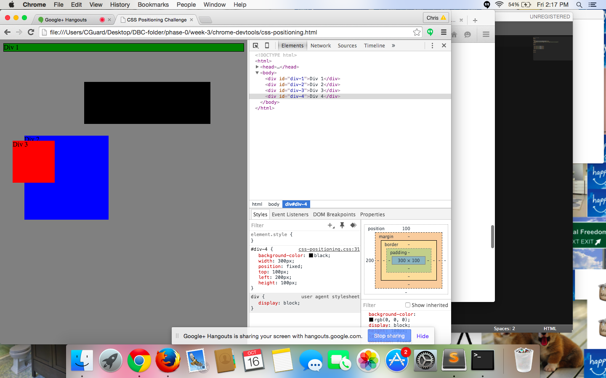
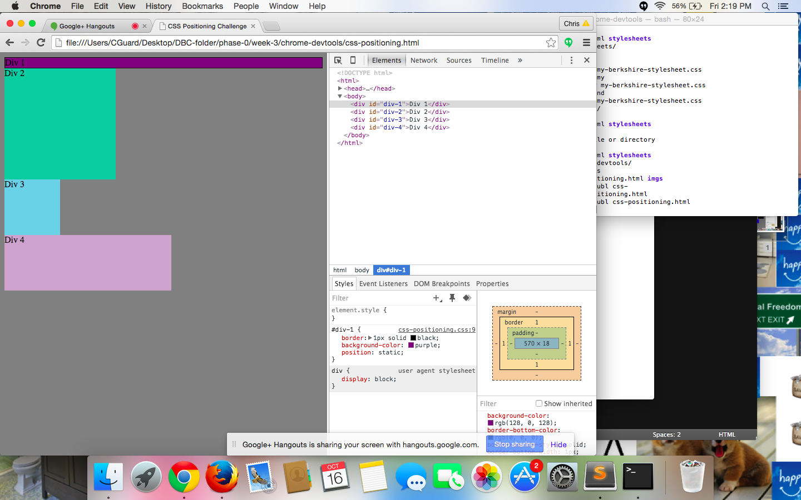
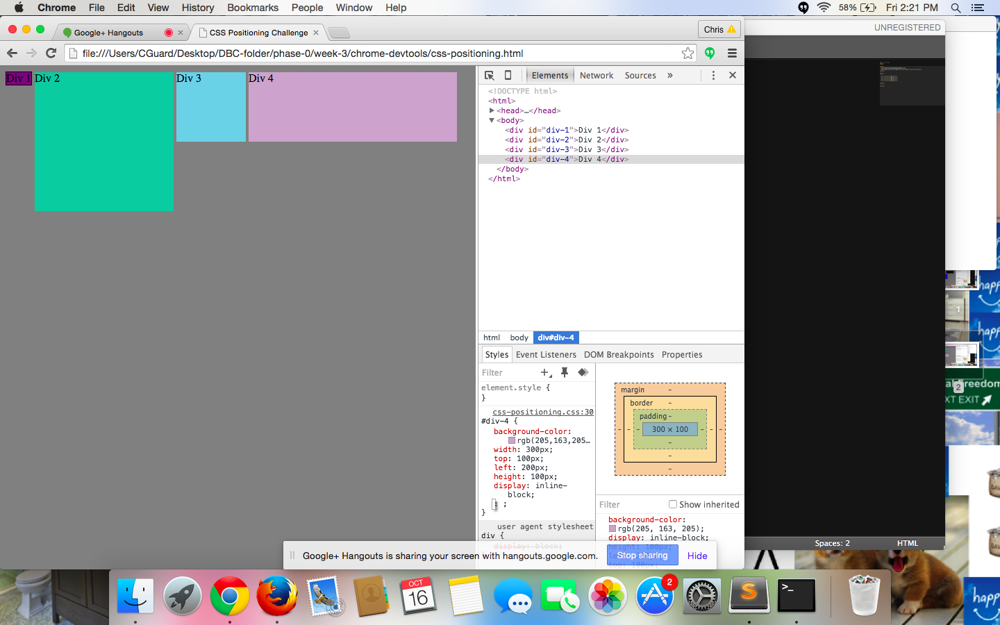
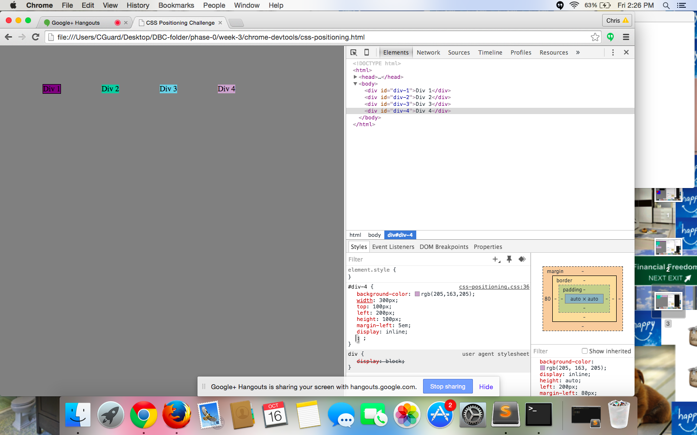
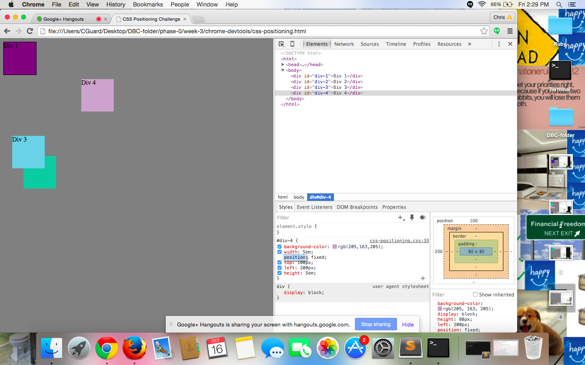
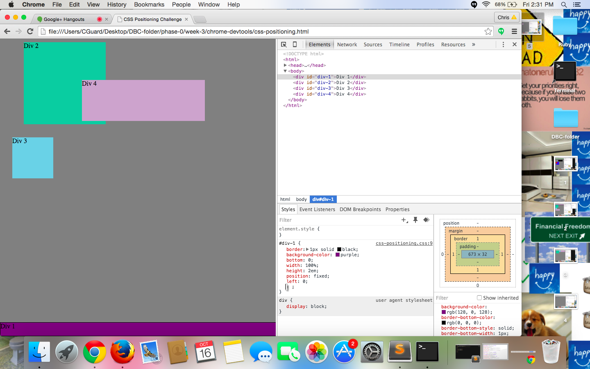
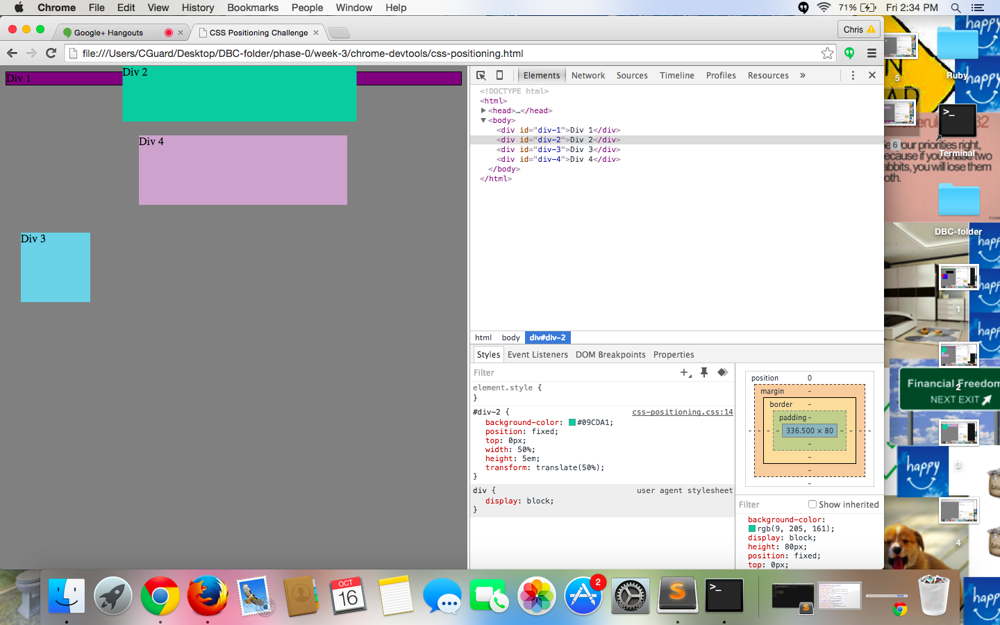
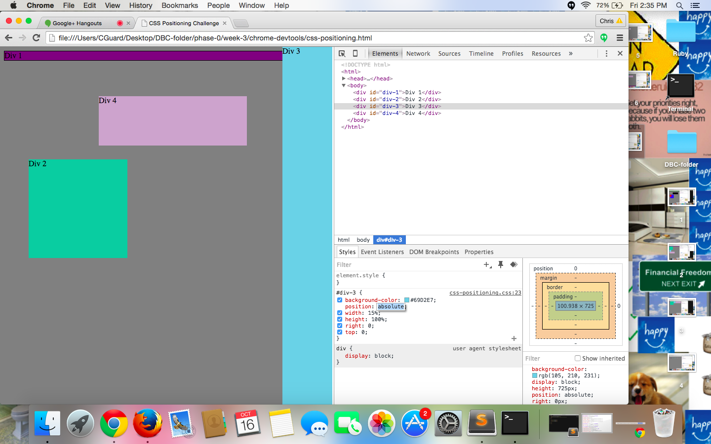
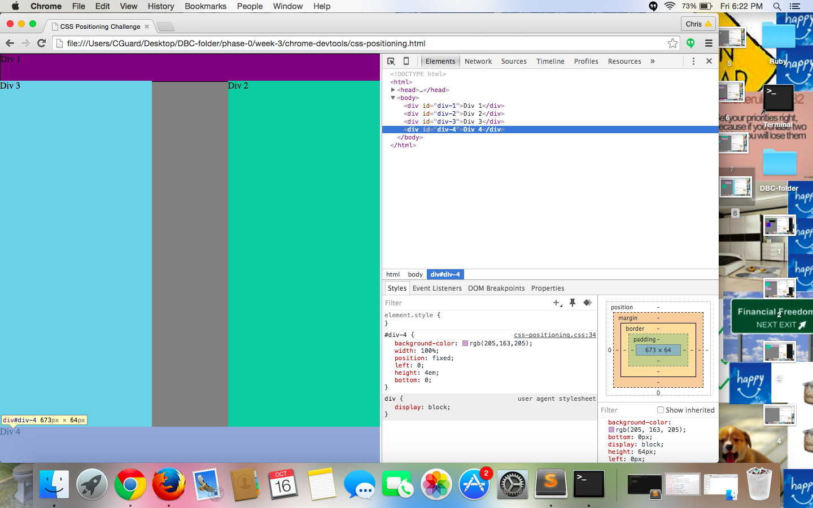

    How can you use Chrome's DevTools inspector to help you format or position elements?
You can essentially play with the coding elements without consequence until you get it to do what you want it to do. If you're unsure how to code what you want, it pretty much makes for an awesome playground to work in to test different things out.

    How can you resize elements on the DOM using CSS?
There are a lot of options: You can change the size using em, %, or px. You can edit the height, and width of an objection. I'm sure there are others that I'm leaving out but there are many options.

    What are the differences between Absolute, Fixed, Static, and Relative positioning? Which did you find easiest to use? Which was most difficult?
I found fixed, and absolute most easy to use. I had to research this a bit more so here is what I found. Static is the default position, and it's not something you will have to specify too often. Relative is relative to itself, rather than anything else.

    What are the differences between Margin, Border, and Padding?
The border is the edge of the content, the Margin is the space between the object and other objects on the page. The padding is the space between the content within the object, and the edges of the object itself. Absolute position is when you place an element exactly where you want it, and it is placed in comparison to other elements on the page. Fixed positioning is based on the browser webpage. The element will stay where it is weven if the page is scrolled.

    What was your impression of this challenge overall? (love, hate, and why?)
I thought this challenge was pretty much just a nice playground session with CSS. I enjoyed it. I think it also helped expose me to new things because it was changes I haven't tried to make yet. It also worked a lot more with objects's than I had done before in HTML / CSS, so that was definitely cool.
