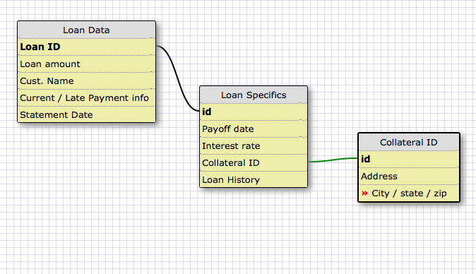
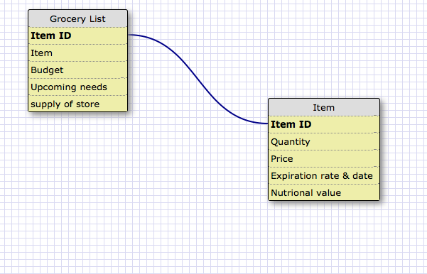

What is a one-to-one database?
A one-to-one database is when a row on a database has a direct relationship to information located on another database. From what I was reading, generally one to one relationships will contain the same number of lines on each table (usually). Additionally it said one to one relationships are used for pieces of information that aren't searched as frequently, so they remove bulk from the more commonly searched database.

When would you use a one-to-one database? (Think generally, not in terms of the example you created). Kinda answered this above... here it is again lol: From what I was reading, generally one to one relationships will contain the same number of lines on each table (usually). Additionally it said one to one relationships are used for pieces of information that aren't searched as frequently, so they remove bulk from the more commonly searched database.

What is a many-to-many database?
Many to many is when an item that has many attributes is linked through a join table to another item that can have many attributes. The example of students and challenges seems particularly relevant, given the course material.

When would you use a many-to-many database? (Think generally, not in terms of the example you created). You would use a many to many database when you would have a large number of nouns working with or on a large number of completely seperate nouns, and each noun in each set had to be tracked seperately (I belive).

What is confusing about database schemas? What makes sense? Lots of things are confusing about it. One to One seems like the worst, becuase visually is still looks to me like a One to Many relationship. Many to Many is easiest to conceptualize, because you have a lot of one thing that relates to a lot of another, and the tables display like you'd expect.

